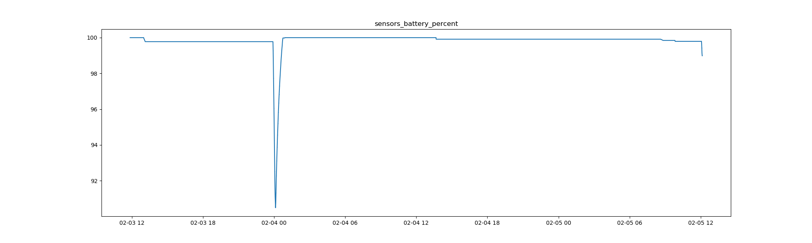
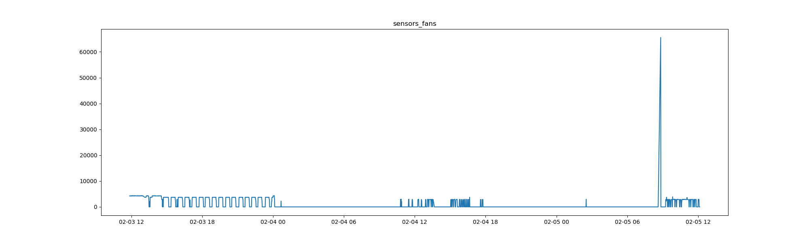
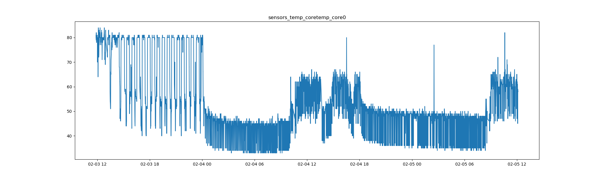
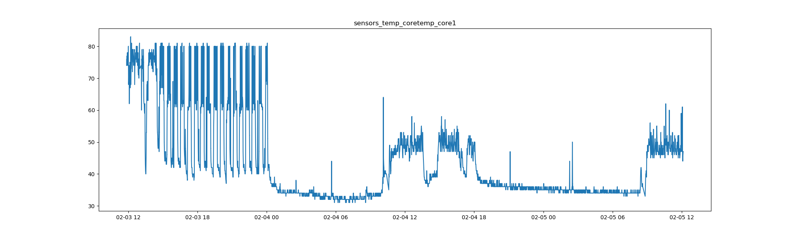
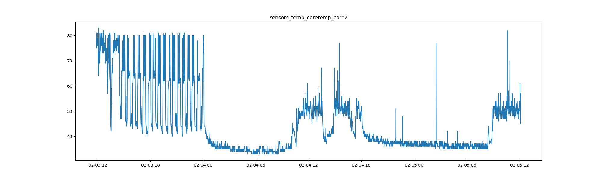
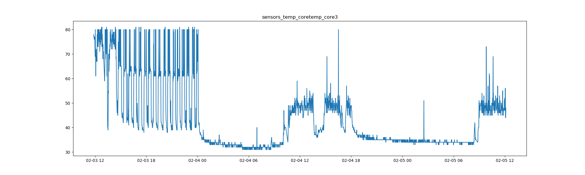
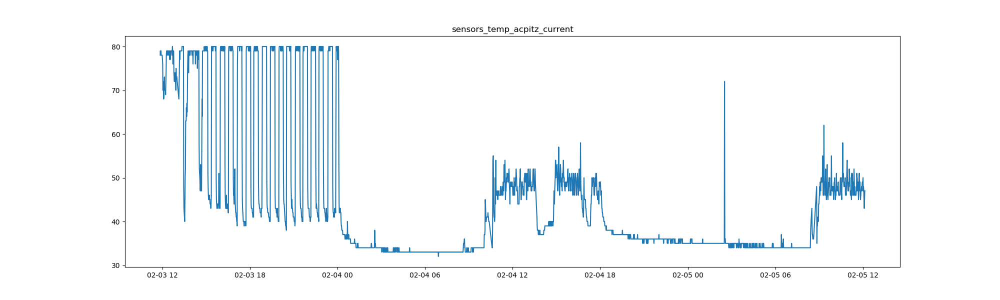
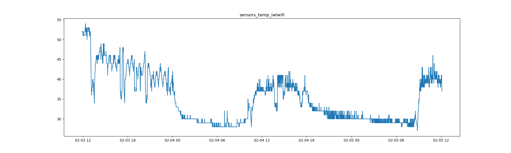
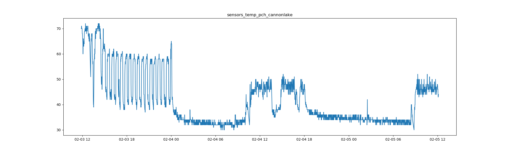
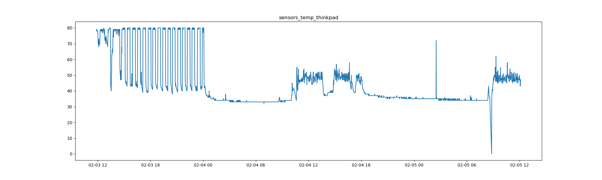

# Ubuntu 18.04 on Thinkpad T490s

This is a small results page to go along with [watchme-sensors](https://github.com/researchapps/watchme-sensors). Specifically, we were interested to look at core temperatures and fan
speeds over a day or two. The x axis for each plot below is a date and time, in the format
MM-DD and then HH. All are for the year 2020.

## Battery Percent



The above mainly demonstrates that the battery is charging (and holding the charge!)
and there is only a brief period of time on the first day when it was unplugged and 
went down to ~90%. While this might not seem impressive, when the laptop was first installed with Ubuntu the USB-C cable was not able to charge it per [this issue](https://www.cnet.com/news/is-your-thinkpads-usb-c-port-not-working-upgrade-its-firmware/). If you find that
you run into this issue, the fix is to update the BIOS, which comes down to 
using the [BIOS Update Utility](https://pcsupport.lenovo.com/us/en/products/laptops-and-netbooks/thinkpad-t-series-laptops/thinkpad-t490s-type-20nx-20ny/downloads/driver-list/component?name=BIOS%2FUEFI) and running these commands:

```bash
cd Downloads/
ls -Ag
fwupdmgr n2jul22w.zip
fwupdmgr install n2jul22w.zip
cd n2jul22w/
# ls
fwupdmgr install N2JET84w.cab
fwupdmgr install N2JET84W.cab
fwupdmgr install N2JHT33W.cab
sudo reboot
```

The download will be for a zip file that include the cab files.

## Fans



The fan speed seems to generally go on and off, and the extreme data point I'd guess
is an outlier (although I'm not sure). I have noticed that the laptop generally runs
a lot hotter than my previous Lenovos, and I'm wondering if the fans aren't working quite right.
Technically (as you will see below) the temperatures don't go above 80 degrees C, but
that is still very hot relative to my previous Lenvos (always below 50).

## Core Temperatures

The next plots are for core temperatures (I have 4 cores!) 







First, I'll note that my behavior matches the plots - I was using the laptop
to program usually late morning to early afternoon, and I gave it a rest in the afternoon
and used a different computer. What I find really interesting is that the original
temperature onsets (close to 80) never actually seemed to return. I point this out
because when I first had the laptop I tried to adjust the percentage of the CPU used:

```bash
echo "1" | sudo tee /sys/devices/system/cpu/intel_pstate/no_turbo
echo "90" | sudo tee /sys/devices/system/cpu/intel_pstate/max_perf_pct
```

but went through this exercise with the intention of testing before doing that.
Now that I've seen this plot, I'm erring on the side of not doing the change.
The laptop stills runs hotter than my previous, but at least for the 4th and 5th
of the month I don't see it going above 60 degrees. Could it be that there is
an initial adjustment period? I likely will need to collect more data to determine this,
and will adapt the script to output a new data file after each day.


## Acpitz Temperature



I needed to look this up to know what it is! Based on [this SA answer](https://askubuntu.com/questions/843231/what-is-the-meaning-of-the-output-of-the-command-sensors)
I am reading that:

> acpitz-virtual-0 is the temperature sensor near/on your CPU socket. This sensor can be unreliable.

So I'm reading this as another temperature sensor, maybe not as reliable.
However it seems to trend with the cores, so maybe it's not too bad.

## iwlwifi Temperature



My best guess is that this is a temperature associated with the wifi. It seems
to follow the same trend, but thankfully is a lot cooler.

## pch cannonlake



I think "Cannon Lake" refers to the CPU, see [here on Wikipedia](https://en.wikipedia.org/wiki/Cannon_Lake_(microarchitecture)). The trend is the same.

## Thinkpad



I wonder if this is an average current temperature for the Thinkpad? Or a sensor
placed somewhere not near the CPU? I'm generally happy to see that it's closer
to what my previous Lenovos have had (around 40 degrees).

This was fun! I'd be really interested to know where exactly those sensors are -
I wish there was some map online that showed the location of all the hardware,
and of course the sensors too.
